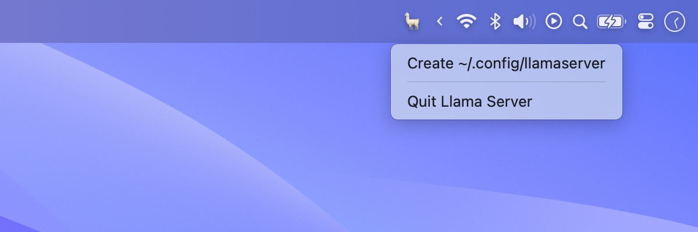
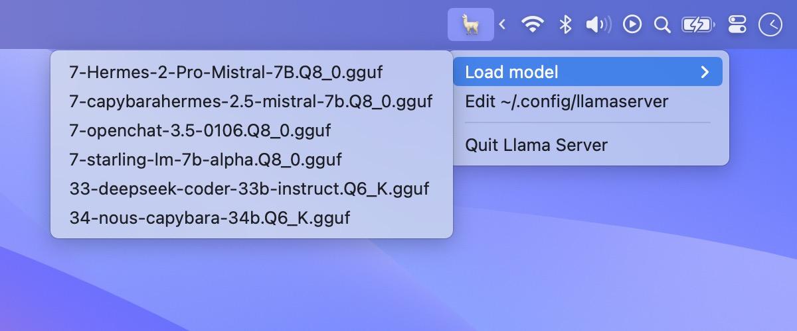
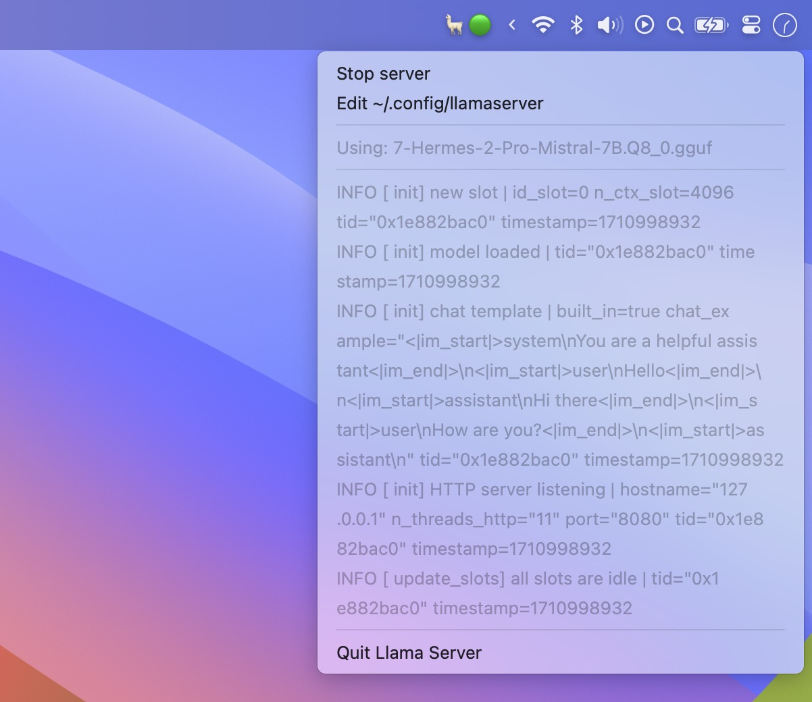

# Llama Server

A Mac menu bar app for controlling llama.cpp server.

This started as a bash script, which turned into a Mac Shortcut, which thanks to Platypus, has grown-up into an Real App. But in its heart, Llama Server is still just a humble bash script calling another bash script.

## Usage

Download it from Releases and drag it into your Applications directory.

Click the menu bar icon to create your configuration file (`~/.config/llamaserver/options.sh`). This defines the locations of your [llama.cpp server script](https://github.com/ggerganov/llama.cpp/tree/master/examples/server) and models, as well as a list of CLI flags.

Use "Load model" to choose from a list of `*.guff` models from your configured directory:

While a running `llama.cpp/server` process is detected, the menu will show the last 5 lines of server output. Click "Stop server" to unload the model:

Due to a limitation of Platypus, the menu bar icon doesn't update in the background. You need to click the icon again to get fresh logs.

## Roadmap

- [ ] Set per-model server settings (ex: `ctx-size`)
- [ ] Cache the server script PID for better `pkill` precision
- [ ] Find way to deliver realtime menu bar icon updates
- [ ] Notify when server is ready

## Credits

- [**llama.cpp**](https://github.com/ggerganov/llama.cpp) for the excellent foundation.
- [**Platypus**](https://github.com/sveinbjornt/Platypus) for making wrapper apps easy.
- [**Draw Things**](https://drawthings.ai/) for the spiffy icon.
